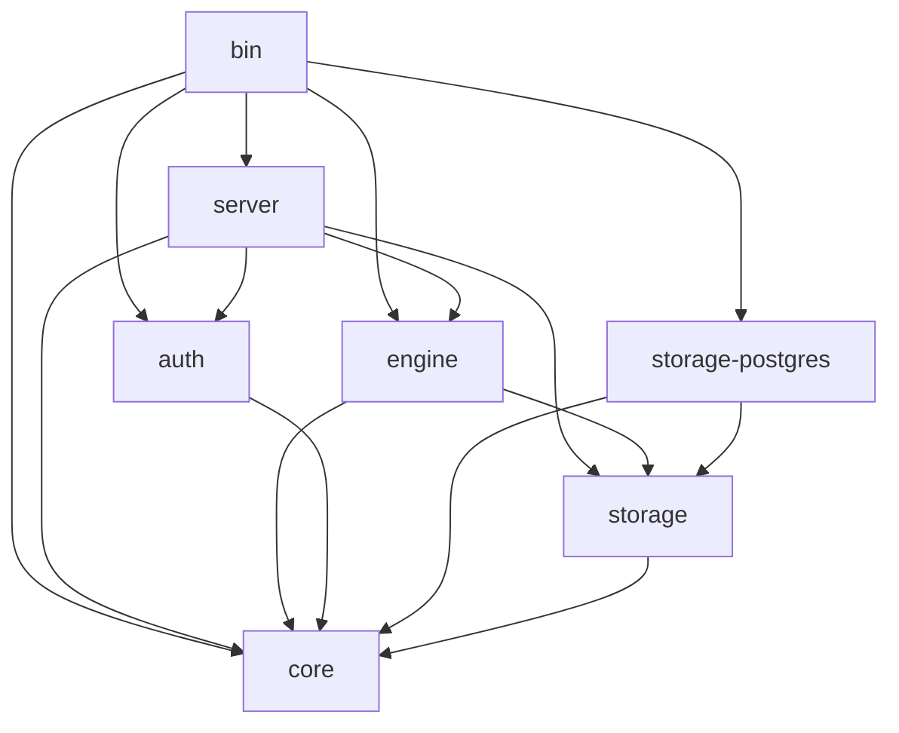
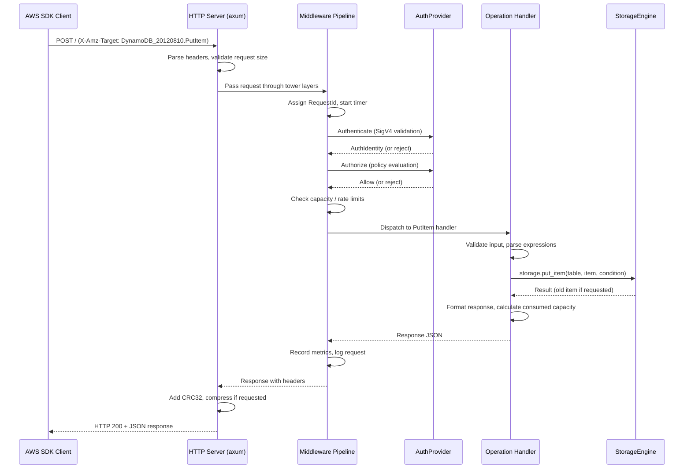

# extenddb — High-Level Design

**Version:** 1.0
**Date:** 2026-04-03
**Status:** Draft

## 1. Architecture Overview

extenddb (ExtendDB) is a standalone async Rust application structured as a Cargo workspace. It receives DynamoDB wire protocol requests over HTTP, authenticates and authorizes them via a pluggable auth provider, executes the operation logic in a backend-agnostic core, and delegates persistence to a pluggable storage engine.

```
┌─────────────────────────────────────────────────────────────────────┐
│                     AWS SDK Client (any language)                   │
│              HTTP POST + SigV4 Authorization header                 │
└──────────────────────────────┬──────────────────────────────────────┘
                               ▼
┌─────────────────────────────────────────────────────────────────────┐
│                        HTTP Server (axum/tower)                     │
│  TLS · request size limits · rate limiting · gzip · CRC32           │
│  routing: X-Amz-Target → operation handler                          │
└──────────────────────────────┬──────────────────────────────────────┘
                               ▼
┌─────────────────────────────────────────────────────────────────────┐
│                      Middleware Pipeline (tower layers)             │
│  RequestId → Logging → Auth → Capacity → Metrics                    │
└──────────────────────────────┬──────────────────────────────────────┘
                               ▼
┌─────────────────────────────────────────────────────────────────────┐
│                     Engine (async operation handlers)               │
│  Operation dispatch · response formatting · stream record assembly  │
├─────────────────────────────────────────────────────────────────────┤
│                     Core (pure sync — no async runtime)             │
│  Types · expression parsing/evaluation · validation · capacity      │
│  error types · configurable limits                                  │
└──────────────┬───────────────────────────────────┬──────────────────┘
               ▼                                   ▼
┌──────────────────────────┐         ┌────────────────────────────────┐
│     AuthProvider trait   │         │     StorageEngine trait        │
│  ┌────────────────────┐  │         │  ┌────────────────────────┐    │
│  │ Built-in SigV4     │  │         │  │ PostgreSQL (sqlx)      │    │
│  │ AWS IAM (future)   │  │         │  │ SQLite (future)        │    │
│  │ Azure AD (future)  │  │         │  │ MySQL (future)         │    │
│  └────────────────────┘  │         │  └────────────────────────┘    │
└──────────────────────────┘         └────────────────────────────────┘
```

## 2. Cargo Workspace Structure

```
extenddb/
├── Cargo.toml                    # Workspace root
├── config.example.toml           # Example configuration file
├── docs/                         # Design documentation (this folder)
│
├── crates/
│   ├── core/                     # DynamoDB types, expressions, validation (pure sync, no async runtime)
│   │   ├── Cargo.toml
│   │   └── src/
│   │       ├── lib.rs
│   │       ├── types/            # AttributeValue, KeySchema, TableMetadata, etc.
│   │       ├── expression/       # Parser, AST, evaluators (condition, filter, update, projection)
│   │       ├── validation/       # Input validation (naming rules, size limits, type checks)
│   │       ├── capacity/         # RCU/WCU calculation, throughput tracking, throttling
│   │       ├── error/            # DynamoDbError enum, error messages, HTTP status mapping
│   │       └── limits/           # Configurable limit definitions and enforcement
│   │
│   ├── engine/                   # Operation handlers — async, depends on core + storage
│   │   ├── Cargo.toml
│   │   └── src/
│   │       ├── lib.rs            # OperationContext, dispatch
│   │       ├── put_item.rs
│   │       ├── get_item.rs
│   │       ├── update_item.rs
│   │       ├── delete_item.rs
│   │       ├── query.rs
│   │       ├── scan.rs
│   │       ├── batch_get.rs
│   │       ├── batch_write.rs
│   │       ├── transact_get.rs
│   │       ├── transact_write.rs
│   │       ├── create_table.rs
│   │       ├── delete_table.rs
│   │       ├── describe_table.rs
│   │       ├── update_table.rs
│   │       ├── list_tables.rs
│   │       ├── tagging.rs
│   │       ├── ttl.rs
│   │       ├── describe_endpoints.rs
│   │       ├── describe_limits.rs
│   │       └── import_export.rs
│   │
│   ├── storage/                  # StorageEngine trait + shared types
│   │   ├── Cargo.toml
│   │   └── src/
│   │       ├── lib.rs
│   │       ├── trait.rs          # StorageEngine trait definition
│   │       ├── types.rs          # Storage-specific types (QueryParams, ScanParams, etc.)
│   │       └── error.rs          # StorageError type
│   │
│   ├── storage-postgres/         # PostgreSQL backend implementation
│   │   ├── Cargo.toml
│   │   ├── migrations/           # SQL migration files
│   │   └── src/
│   │       ├── lib.rs
│   │       ├── engine.rs         # StorageEngine impl for PostgreSQL
│   │       ├── schema.rs         # Table/index DDL generation
│   │       ├── item.rs           # Item CRUD operations
│   │       ├── query.rs          # Query/Scan SQL generation
│   │       ├── transaction.rs    # Transaction support
│   │       └── migration.rs      # Schema migration runner
│   │
│   ├── auth/                     # AuthProvider trait + built-in SigV4 + policy engine
│   │   ├── Cargo.toml
│   │   └── src/
│   │       ├── lib.rs
│   │       ├── trait.rs          # AuthProvider trait definition
│   │       ├── sigv4/            # SigV4 signature validation
│   │       ├── policy/           # IAM policy evaluation engine
│   │       ├── credential/       # Credential storage and caching
│   │       └── identity.rs       # AuthIdentity type
│   │
│   ├── server/                   # HTTP server, middleware, routing
│   │   ├── Cargo.toml
│   │   └── src/
│   │       ├── lib.rs
│   │       ├── router.rs         # X-Amz-Target routing
│   │       ├── middleware/        # Tower layers (auth, capacity, logging, metrics, etc.)
│   │       ├── request.rs        # Request parsing and deserialization
│   │       ├── response.rs       # Response formatting (CRC32, compression, headers)
│   │       ├── health.rs         # /health and /metrics endpoints
│   │       └── tls.rs            # TLS configuration
│   │
│   └── bin/                      # Thin binary that wires everything together
│       ├── Cargo.toml
│       └── src/
│           └── main.rs           # CLI parsing, config loading, server startup
```

### 2.1 Crate Dependency Graph



**Key principle:** `core` depends on nothing in the workspace and has no async runtime — it is pure sync Rust (types, expressions, validation, capacity, errors). `storage` depends only on `core`. `engine` depends on `core` + `storage` and contains the async operation handlers. Backend crates depend on `storage` + `core`. `auth` depends on `core`. `server` depends on `core` + `storage` + `auth` + `engine`. `bin` wires everything together.

## 3. Request Lifecycle



## 4. Key Design Decisions

### 4.1 Cargo Workspace with Crate Boundaries

**Decision:** Structure as a Cargo workspace with 7 crates.

**Rationale:**
- Compile-time enforcement of dependency boundaries — the storage trait crate physically cannot depend on PostgreSQL
- `core` is pure sync Rust with no async runtime — types, expressions, validation, capacity, errors
- `engine` contains async operation handlers that depend on `core` + `storage`, keeping the async boundary explicit
- Independent testing — `cargo test -p dynamodb-core` needs no database and no async runtime
- Faster incremental builds — changing the Postgres backend doesn't recompile the expression parser
- Clean extension points — adding a SQLite backend is a new crate, zero changes to existing code
- Lean dependency trees — core has no async runtime, no database drivers, no HTTP framework

### 4.2 axum + tower for HTTP

**Decision:** Use axum as the HTTP framework with tower middleware layers.

**Rationale:**
- axum is the de facto standard for async Rust HTTP servers, built on top of hyper and tower
- tower's `Layer` and `Service` traits provide composable middleware that maps directly to the DynamoDB middleware pipeline (auth, capacity, metrics, logging)
- Native async/await with tokio — no blocking threads, efficient connection handling
- Mature ecosystem with TLS (rustls), compression, and graceful shutdown support
- axum's extractor pattern cleanly maps to parsing DynamoDB request headers and bodies

### 4.3 Trait-Based Pluggability

**Decision:** Define `StorageEngine` sub-traits as async traits using RPITIT (Return Position Impl Trait In Trait, stable since Rust 1.75), selected at startup via enum dispatch. Define `AuthProvider` and `CredentialStore` using `#[async_trait]` for object-safe dynamic dispatch.

**Rationale:**
- **Storage (RPITIT + enum dispatch):** RPITIT avoids the `Box<dyn Future>` heap allocation per call that `async_trait` introduces — at high throughput on the data path this matters. Since RPITIT traits are not object-safe, the backend is selected at startup via an enum dispatch wrapper in the `bin` crate (e.g., `enum Storage { Postgres(PostgresEngine) }`) rather than `Arc<dyn StorageEngine>`. The enum dispatch approach has zero overhead (static dispatch) and the match arms are generated once at startup.
- **Auth (`#[async_trait]` + `Arc<dyn>`):** Both `AuthProvider` and `CredentialStore` use `#[async_trait]` for object safety. Auth is called once per request and involves crypto operations (SigV4 HMAC-SHA256, policy evaluation) that dwarf the cost of a single `Box<dyn Future>` allocation. Using `#[async_trait]` makes `AuthProvider` object-safe, allowing `Arc<dyn AuthProvider>` in the server crate without enum wrappers. `CredentialStore` uses `#[async_trait]` for the same reason — it allows `Arc<dyn CredentialStore>` inside `BuiltinAuthProvider`, avoiding a generic parameter that would propagate up through the auth provider. Note: `CredentialStore` (in the `auth` crate) is a separate trait from `CredentialEngine` (in the `storage` crate, which uses RPITIT). The `bin` crate bridges them with a thin adapter.
- Avoids monomorphization bloat from generic parameters threaded through the entire codebase
- Clean testing — mock implementations for unit tests, real backends for integration tests

### 4.4 Expression Engine in Core (No Database Dependency)

**Decision:** The expression parser and evaluator live in the `core` crate and operate on in-memory `AttributeValue` types.

**Rationale:**
- Expressions are DynamoDB-specific logic, not storage-specific — `FilterExpression` is evaluated after items are fetched, `ConditionExpression` is evaluated against the current item before a write
- Keeping expressions in core means every storage backend gets the same expression behavior for free
- The storage backend only needs to handle `KeyConditionExpression` translation to its native query language (e.g., SQL WHERE clauses for partition key equality + sort key range)
- This matches how DynamoDB actually works: filter expressions are applied after the read, not pushed down to the storage layer

**Important:** While the expression evaluator lives in `core`, `ConditionExpression` evaluation for writes is called by the storage backend inside its transaction (after `SELECT FOR UPDATE`). The storage backend imports `core::expression::evaluate_condition` and calls it within the transaction to prevent TOCTOU races. `FilterExpression` evaluation happens in the core handler after items are returned — this is safe because filters are read-only post-processing.

### 4.5 Configuration: TOML + Env Vars + CLI

**Decision:** Layered configuration with precedence: CLI flags > env vars > config file > defaults.

**Rationale:**
- TOML config file for VM deployments (managed by Ansible/Chef, reviewed in PRs)
- Env var overrides for Kubernetes (ConfigMaps, Secrets)
- Minimal CLI flags (`--config`, `--version`, `--validate-config`)
- Standard pattern used by Consul, Vault, Vector, and most production Rust services
- Implemented with `config` crate + `serde` + `clap`

### 4.6 Async All the Way Down

**Decision:** The entire stack is async (tokio runtime), including the storage trait.

**Rationale:**
- The original pg_dynamodb extension was forced into blocking mode by PostgreSQL SPI constraints. As a standalone process, we have no such limitation
- Async I/O is essential for handling thousands of concurrent connections efficiently
- sqlx provides native async PostgreSQL support
- The storage trait being async allows backends that use network I/O (e.g., a future DynamoDB-backed backend for testing, or a distributed storage backend)

### 4.7 Read Consistency via Optional Read Replica

**Decision:** All reads are strongly consistent by default. Eventually consistent reads (`ConsistentRead=false`) are supported by routing to an optional PostgreSQL streaming replica.

**Rationale:**
- DynamoDB's eventual consistency is a consequence of reading from storage replicas that haven't received the latest write yet — it's not artificial delays or queues
- Strongly consistent is strictly stronger than eventually consistent — any application that works against eventually consistent DynamoDB also works against a strongly consistent backend
- For migration testing (relational → DynamoDB), teams need to surface bugs where application code assumes strong consistency on default reads. A real read replica provides genuine staleness without synthetic delays
- The read replica is opt-in via `storage.postgres.read_replica_url`. When unset, all reads hit the primary — simple, correct, and matching what DynamoDB Local and other emulators do
- Writes always go to the primary. `ConsistentRead=true` always reads from the primary. Only `ConsistentRead=false` reads route to the replica
- Capacity calculations always reflect the consistency mode (0.5 RCU for eventually consistent, 1.0 RCU for strongly consistent) regardless of whether a replica is configured
- This requires zero changes to the storage trait, engine, or server — it's entirely contained in the PostgreSQL backend's pool selection logic

## 5. Data Flow

### 5.1 Write Path (PutItem Example)

```
1. HTTP layer receives POST, extracts X-Amz-Target: DynamoDB_20120810.PutItem
2. Middleware: assign RequestId, authenticate (SigV4), authorize (policy check)
3. Middleware: check capacity (reject if ProvisionedThroughputExceeded)
4. Dispatch to PutItem handler in engine
5. Validate input: table name, item size, key attributes present, attribute types
6. If ConditionExpression present: parse expression into AST
7. If streams enabled: construct StreamRecord (will be persisted atomically with data)
8. Call storage.put_item(table_name, item, condition, expression_context, stream_record)
   - Storage backend: BEGIN transaction
   - SELECT FOR UPDATE existing item (for condition check + ReturnValues)
   - If condition: call core's evaluate_condition() against existing item INSIDE the transaction
   - If condition fails: ROLLBACK, return ConditionFailed { old_item }
   - Insert/upsert item
   - If GSIs exist: update GSI tables (within same transaction)
   - If stream_record provided: INSERT stream record (within same transaction)
   - COMMIT
9. Calculate consumed capacity (item size → WCU)
10. Format response (Attributes if ReturnValues=ALL_OLD, ConsumedCapacity if requested)
11. Middleware: record metrics, log request
12. HTTP layer: add CRC32 header, compress, send response
```

> **Key invariant:** Condition evaluation, data write, GSI updates, and stream record capture all happen within a single PostgreSQL transaction. This prevents TOCTOU races (another request modifying the item between condition check and write) and ensures atomicity of stream capture.

### 5.1b Write Path (UpdateItem — Additional Detail)

UpdateItem is more complex than PutItem because the storage backend must also apply the update expression inside the transaction:

```
8. Call storage.update_item(table_name, key, updates, condition, expression_context, stream_capture)
   - Storage backend: BEGIN transaction
   - SELECT FOR UPDATE existing item by primary key
   - If no existing item: create a new item containing only the key attributes (UpdateItem is an upsert)
   - If condition: call core's evaluate_condition() against existing item (or empty key-only item) INSIDE the transaction
   - If condition fails: ROLLBACK, return ConditionFailed { old_item }
   - Call core's apply_update(actions, &mut item, ctx) → modified item
   - Validate modified item (size limits, key attributes unchanged)
   - INSERT/UPDATE the modified item
   - If GSIs exist: update GSI tables (within same transaction)
   - If stream_capture provided: construct full StreamRecord (with old_image/new_image based on stream_view_type), INSERT stream record (within same transaction)
   - COMMIT
```

> **Key detail:** Both `evaluate_condition` and `apply_update` are sync functions from the `core` crate. The storage backend calls them inside its transaction, passing the item fetched by `SELECT FOR UPDATE`. This ensures the condition is evaluated and the update is applied against the same snapshot, with no TOCTOU window.

> **Upsert behavior:** If the item does not exist, DynamoDB's `UpdateItem` creates it. The storage backend must initialize a new item with the key attributes from the request, then apply the update expression to it. For example, `SET #count = if_not_exists(#count, :zero) + :one` on a non-existent item creates the item with the key attributes plus `count = 1`.

> **Stream record construction:** Unlike PutItem/DeleteItem where the engine can pre-construct the full `StreamRecord`, UpdateItem's `new_image` is not known until after `apply_update` runs inside the transaction. The engine passes a `StreamCapture` struct with metadata (stream ARN, view type, shard ID, sequence number, keys), and the storage backend constructs the full `StreamRecord` after the update, populating `old_image` and `new_image` based on the `stream_view_type`.

### 5.2 Read Path (Query Example)

```
1. HTTP layer receives POST, extracts X-Amz-Target: DynamoDB_20120810.Query
2. Middleware: authenticate, authorize, check capacity
3. Dispatch to Query handler in engine
4. Validate input: table name, key condition, index name
5. Parse KeyConditionExpression → extract partition key value + sort key condition
6. Call storage.query(table_name, index_name, key_condition, limit)
   - Storage backend: translate key condition to native query (e.g., SQL WHERE)
   - Execute query with limit
   - Return items + last evaluated key
7. For each returned item:
   a. If FilterExpression: evaluate against item, exclude non-matching
   b. If ProjectionExpression: project to requested attributes only
8. Accumulate response size; stop at 1 MB limit, set LastEvaluatedKey
9. Calculate consumed capacity (total items read × item sizes → RCU)
10. Format response (Items, Count, ScannedCount, LastEvaluatedKey, ConsumedCapacity)
```

## 6. Concurrency Model

extenddb handles concurrent requests through three cooperating layers:

### 6.1 Async Runtime (tokio)

The server runs on a tokio multi-thread runtime. Each incoming HTTP request is handled by an independent async task — there is no shared in-memory state on the hot path. Tasks are scheduled cooperatively across OS threads by the tokio work-stealing scheduler.

### 6.2 PostgreSQL Connection Pool (sqlx)

All database access goes through an sqlx `PgPool`. The pool size is configurable via `storage.postgres.pool_size` in `extenddb.toml` (default: 20). When all connections are in use, new requests queue at the pool level until a connection is returned or the acquire timeout expires. If the timeout expires, the request fails with an internal server error (HTTP 500).

Total connection footprint on the PostgreSQL server:
- `pool_size` connections for DynamoDB data operations (shared by all background workers)
- +2 for the management API (separate pool, `max_connections(2)`)
- +1 for the log-level poller (separate pool, `max_connections(1)`)

So the total is `pool_size + 3`. The default PostgreSQL `max_connections` is 100, which comfortably supports the default pool_size of 20.

### 6.3 Row-Level Locking

Read-modify-write operations (UpdateItem, PutItem with conditions, DeleteItem with conditions, TransactWriteItems) use `SELECT ... FOR UPDATE` to acquire a row-level lock inside a PostgreSQL transaction. This ensures:

- **Atomicity:** The condition check and the write happen against the same snapshot.
- **Serialization:** Concurrent updates to the same item are serialized by PostgreSQL's row lock, not by any in-memory mutex.
- **No TOCTOU races:** Another request cannot modify the item between the condition check and the write.

There is no in-memory locking (no `Mutex`, `RwLock`, or similar) on the data path. All contention is managed by PostgreSQL.

### 6.4 Implications

- **Throughput scales with pool_size.** More connections allow more concurrent transactions. The limit is PostgreSQL's `max_connections` and available CPU/IO.
- **Contention on the same item serializes at the database.** 50 threads incrementing the same counter will queue on the row lock — each update succeeds, but throughput for that single item is bounded by PostgreSQL's single-row transaction rate.
- **Different items have no contention.** Parallel inserts to different keys proceed fully concurrently up to the pool size.

## 7. High-Level Design Choices — Deferred Components

### 7.1 DynamoDB Streams

**Design space:**
- **Option A: Application-layer capture** — The core operation handlers emit stream events after successful writes. The storage trait includes `write_stream_record()`. Stream records are stored in a dedicated table/collection managed by the storage backend.
- **Option B: Storage-layer triggers** — The storage backend uses native CDC (e.g., PostgreSQL LISTEN/NOTIFY or logical replication). More efficient but ties stream behavior to the backend.
- **Option C: Hybrid** — The core handler constructs the stream record (it has access to old/new images). The storage engine persists the stream record in the same transaction as the data write.
- **Recommended direction:** Option C (hybrid). The core crate controls what gets captured (portable), while the storage backend ensures atomicity by writing the data and stream record in a single transaction. This guarantees no stream record without a data write and no data write without a stream record (when streams are enabled).

**Deferred decisions:**
- Shard management strategy (fixed shards vs. dynamic splitting)
- Stream record retention period and cleanup
- Iterator expiration semantics
- Cross-instance stream consistency

### 7.2 Global Tables

**Design space:**
- **Option A: Application-layer replication** — A replication agent reads stream records from one instance and replays them to another. Conflict resolution via last-writer-wins with vector clocks.
- **Option B: Storage-layer replication** — Delegate to the storage backend's native replication (e.g., PostgreSQL logical replication). Simpler but less portable.
- **Recommended direction:** Option A for portability, built on top of DynamoDB Streams.

**Deferred decisions:**
- Conflict resolution strategy (last-writer-wins, vector clocks, CRDTs)
- Replication topology (star, mesh, chain)
- Consistency model (eventual vs. strong)
- Replica management API semantics

## 8. Technology Choices

| Concern | Choice | Rationale |
|---------|--------|-----------|
| Language | Rust (stable) | Performance, safety, ecosystem |
| Async runtime | tokio | De facto standard, mature |
| HTTP framework | axum + tower | Composable middleware, hyper-based |
| HTTP TLS server | axum_server | Adds rustls bind support on top of axum (used only when TLS is enabled) |
| TLS | rustls | No OpenSSL dependency, pure Rust |
| PostgreSQL driver | sqlx | Async, compile-time query checking, migrations |
| Serialization | serde + serde_json | Standard, zero-copy where possible |
| Crypto (SigV4) | hmac + sha2 + constant_time_eq | Pure Rust, audited |
| Crypto (encryption) | aes-gcm | AES-256-GCM for credential encryption |
| Compression | flate2 | gzip support |
| CRC32 | crc32fast | SIMD-accelerated |
| CLI | clap | Standard Rust CLI framework |
| Config | config + serde | Layered config (file + env + defaults) |
| Logging | tracing + tracing-subscriber | Structured, async-aware |
| Metrics | in-memory collector | JSON via `/metrics`, DynamoDB CloudWatch-style names |
| UUID | uuid | Request ID generation |
| Time | time | Timestamp handling (native sqlx support; chrono 0.4.31+ also fixed its localtime_r unsafety, but time has a leaner API) |
| Decimal | bigdecimal | Arbitrary-precision decimal arithmetic for DynamoDB's 38-digit number type |
| Caching | moka | Async-compatible cache with TTL, max-size eviction, and automatic cleanup |
| Async trait | async_trait | Object-safe async traits for `AuthProvider` and `CredentialStore` (storage sub-traits use RPITIT instead) |

---

## License

Copyright 2026 ExtendDB contributors. Licensed under the Apache License, Version 2.0.
See [LICENSE](../../LICENSE) for the full text.

This software is provided "as is" without warranty of any kind. ExtendDB is not
affiliated with, endorsed by, or sponsored by Amazon Web Services. "DynamoDB" is a trademark
of Amazon.com, Inc.
